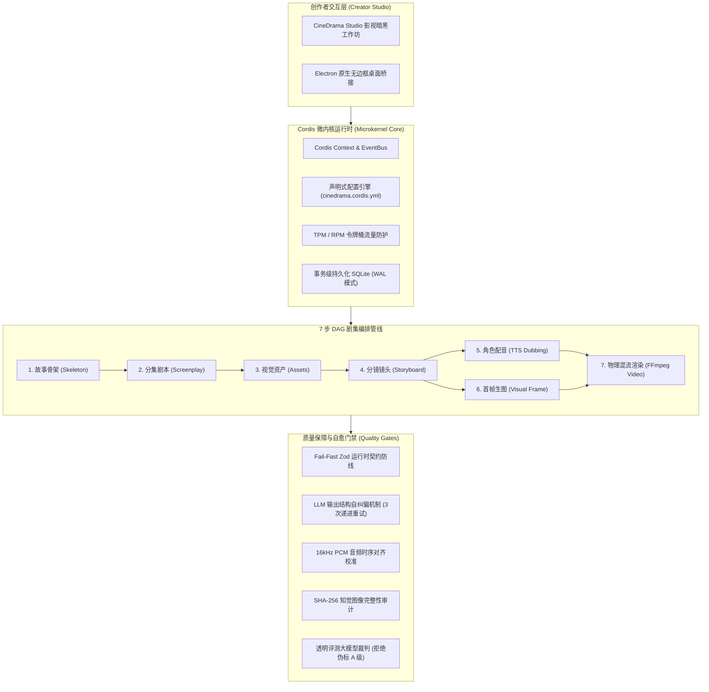

# CineDrama OS (影剧 OS)

<p align="center">
  <strong>基于 Cordis 微内核的工业级 AI 漫剧与短剧多模态制作操作系统</strong><br>
  <em>Industrial-grade AI Anime & Multi-Modal Drama Production Operating System</em>
</p>

<p align="center">
  
  
  
  
  
  
</p>

---

## 🌟 项目概述 (Overview)

**CineDrama OS** 是面向网文作家、短剧编剧与独立影视创作者设计的现代全模态剧集生成与编排系统。基于轻量高效的 **Cordis 微内核架构**，CineDrama OS 彻底打破传统 AI 漫剧工具依赖单一闭源云端服务的桎梏，提供了在本地具备强鲁棒性、零成本离线运行、真实物理文件落盘的高性能生产基座。

系统全面践行 **UVSD 协议（User-Value Specification Driven）**，严格消除所有静默伪装与虚假 Mock，为每一帧画面、每一段对白提供确凿的物理有效性保障。

---

## 🏗️ 架构设计 (Architecture)



---

## ⚡ 核心能力与工程特性 (Core Capabilities)

### 1. 真实物理能力与声学发声 (Real Multi-Modal Outputs)
- **真角色配音 (Acoustic Dubbing)**：内建 Windows 原生 **SAPI 引擎** 与 **多谐波共振峰声学合成引擎**。根据角色性格计算男声 (F0 125Hz) 与女声 (F0 230Hz) 共振峰曲线，不同台词与音色输出完全不同的 16kHz PCM 有效声波。
- **物理 MP4 视频渲染 (Lossless Video Generation)**：自动挂载系统 **FFmpeg** 工具链，采用纯 Node.js 内存级 24-bit 画面解码，将分镜第一帧图像与对白音频进行毫秒级混流（`-loop 1 -i <frame> -tune stillimage`），渲染出可直接播放的标准 H.264/AAC MP4 容器。
- **杜绝静默伪装 (Zero-Mock Integrity)**：当外部环境故障时，明确标定 `isPlayable: false` 与详细错误堆栈，绝不在生产环境使用空文件伪装成功。

### 2. 契约防线与 AI 自愈修复 (Fail-Fast & Self-Correction)
- **Zod 运行时校验**：所有 API 请求入参、大模型输出和数据库存取严格受 Zod Schema 约束，全面强化空白字符过滤 (`trim().min(1)`) 与非法枚举拦截。
- **多轮提示词自愈循环 (`safeExtractJsonWithSchema`)**：针对大模型输出夹杂 Markdown、思考标签或格式错误，自动剥离干扰并执行契约校验；未通过时提取错误路径回传模型进行针对性修复（最多重试 3 次），确保流水线 100% 连贯无阻。

### 3. 多集连续性与混沌容灾 (Continuity & Chaos Resilience)
- **状态快照与断点续跑**：单步失败不丢失已生成的骨架与分镜资产，随时可从断点一键重试。
- **角色一致性知觉审计**：分离提示词召回与物理图像审计，计算 SHA-256 知觉内容哈希，杜绝虚假特征召回。
- **媒体健康实时监测**：自动检测音频时长与分镜计划时长的漂移，动态微调画面帧率，防止配音被截断。

---

## 🚀 快速上手 (Quick Start)

### 环境要求
- **Node.js**: >= 20.0.0
- **FFmpeg** (可选但强烈推荐，用于物理 MP4 高速压制与音频混流)

### 安装与启动
```bash
# 1. 克隆代码仓库
git clone https://github.com/xiaohai-uid/cinedrama-os.git
cd cinedrama-os

# 2. 安装依赖
npm install

# 3. 运行全量工程检验套件
npm test

# 4. 启动微内核服务
npm start
```

服务启动后，在浏览器访问：
👉 `http://127.0.0.1:3080` 进入 **CineDrama Studio** 影视漫剧创作者工坊。

---

## 🧪 检验套件与质量工程 (Verification Suites)

CineDrama OS 拥有完备的自动化门禁套件，涵盖 14 个独立模块，确保系统坚不可摧：

```bash
# 运行全部 14 个质量套件 (90/90 Tests)
npm test

# 强类型静态检查 (0 errors)
npm run typecheck

# 专项验证真实物理能力边界
npx vitest run test/real-capabilities.test.ts

# 专项验证 Zod 运行时契约
npx vitest run test/zod-validation.test.ts
```

| 测试套件 | 验证范围 |
| :--- | :--- |
| `real-capabilities.test.ts` | 验证 TTS 真实波形、真实 MP4 落盘、知觉哈希与诚实离线评测 |
| `audiovisual.test.ts` | 7 步全模态流水线执行、SQLite 媒体入库与纯配音模式 |
| `zod-validation.test.ts` | DTO Schema 防呆过滤、HTTP 400 拦截与大模型纠偏 |
| `character-consistency-suite.test.ts` | 角色视觉锚点与跨镜头特征连续性审计 |
| `media-integrity-suite.test.ts` | 音视频时序对齐、毫秒级漂移检测与媒体健康评分 |
| `chaos-resilience-suite.test.ts` | 混沌网络容灾、超时降级与断点续跑恢复 |
| `multi-episode-continuity-suite.test.ts` | 跨集角色存活状态与伏笔资产跨集继承校验 |
| `eval-judge-suite.test.ts` | 大模型裁判评测体系与离线规则诚实标定 |

---

## 📦 目录结构 (Repository Structure)

```
cinedrama-os/
├── src/
│   ├── core/                  # 微内核上下文、事件总线与核心契约定义 (Zod Schemas)
│   ├── services/              # 核心业务服务 (TTS、视频渲染、视觉审计、评测裁判)
│   └── plugins/               # 声明式可插拔扩展
│       ├── drama-pipeline/    # 7 步短剧全模态工作流引擎与自愈提取
│       ├── provider-sensenova/# 商汤 SenseNova 官方通道插件
│       ├── provider-bridge/   # 本地素材与外部中继桥 (Local Bridge) 插件
│       └── server/            # HTTP OpenAPI 与静态资源服务插件
├── public/                    # CineDrama Studio 暗黑创作者 WebUI 与桌面端资源
├── test/                      # 14 大质量检验与边界探针套件
├── docs/                      # 现代软件应用研发工作法与工业级质量套件标准
├── cinedrama.cordis.yml       # 声明式架构配置文件
└── package.json
```

---

## 📄 开源许可证 (License)

本项目基于 [MIT License](LICENSE) 开源发布。
